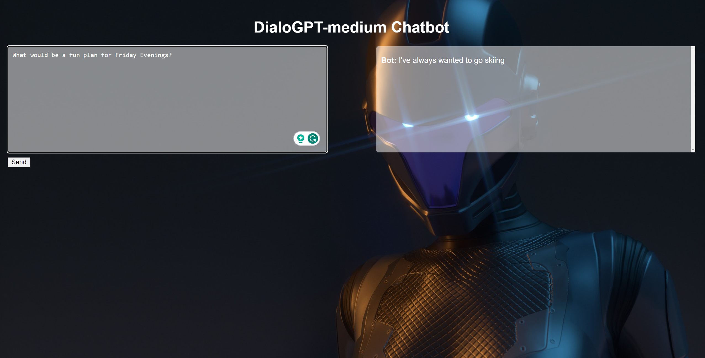

# Dockerized Flask Chatbot

This repository contains a Flask chatbot application that utilizes the DialoGPT language model by Microsoft. The chatbot can generate responses based on user prompts and offers an interactive conversation experience.



## Features

- Generate responses using the DialoGPT language model
- Filter responses based on user prompts
- Interactive conversation with the chatbot

## Prerequisites

- Python 3.10.11
- Docker


## Getting Started

1. Clone the repository:
```
git clone https://github.com/Farzad-R/dockerized-flask-chatbot.git
```

2. Navigate to the project directory:

```
cd dockerized-flask-chatbot
```

3. Create a virtual environment:
```
python3 -m venv env
source env/bin/activate
```

4. Install the required packages:

```
pip install -r requirements.txt
```
### Running on the terminal

5. Open terminal and run:
```
python app.py
```

Open your web browser and visit `http://127.0.0.1:5000/` to access the chatbot interface.

### Running on a docker container

6. Build the Docker image:
```
docker build -t flask-chatbot .
```

7. Run the Docker container:
```
docker run -p 5000:5000 flask-chatbot
```

Open your web browser and visit `http://127.0.0.1:5000/` to access the chatbot interface.

## Configuration
You can customize the chatbot behavior by modifying the parameters in the generate_response() function in the app.py file. Adjust the max_length, temperature, top_k, and num_return_sequences parameters to fine-tune the response generation process.